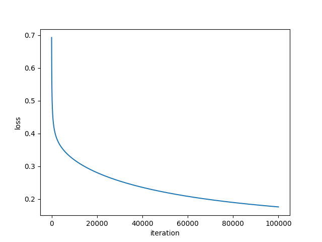
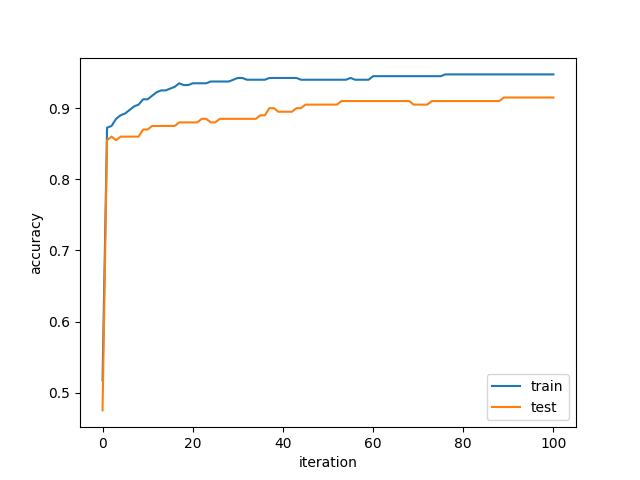
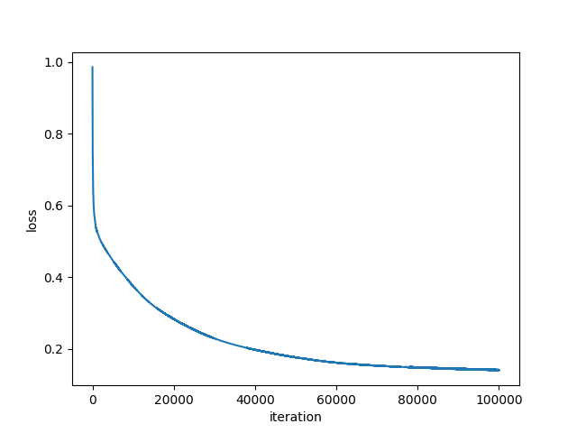
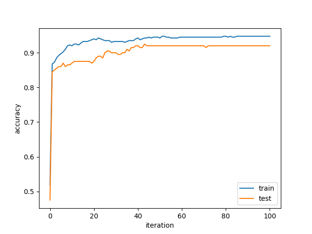
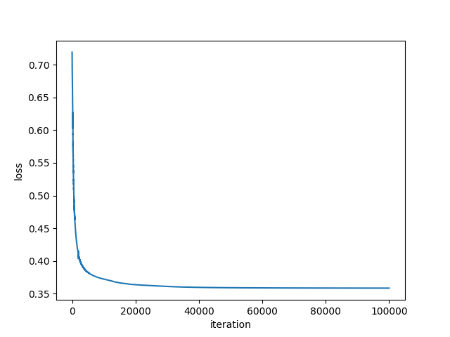
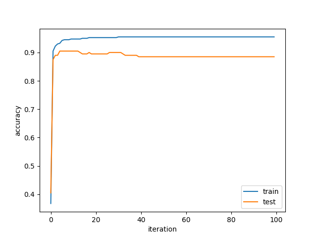
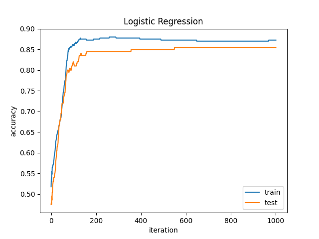
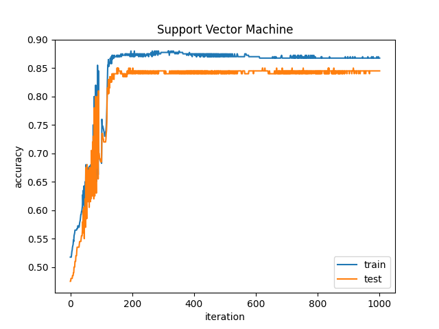
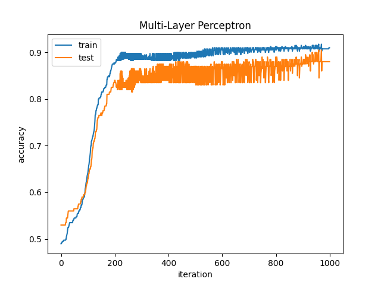

# Lab Report

#### Author: *刘佳隆*

#### Student ID: *518010910009*

## Logistic Regression

### Parameter Settings

- Learning rate: 0.0001
- Iteration times: 100000 (In used)
- Convergence condition: 0.00001 (Not used)

### Result

> 上图中的迭代次数基数为 1000（下同）

- Testing accuracy: 0.915
- Training accuracy: 0.9475
- Training mean loss: 0.1755900108060871
- Training time: 64.88919115066528 seconds

## Support Vector Machine

### Parameter Settings

- Learning rate: 0.00005
- Lambda: 0.1
- Iteration times: 100000 (In used)
- Convergence condition: 0.00001 (Not used)

### Result

- Testing accuracy: 0.92
- Training accuracy: 0.9475
- Training mean loss: 0.14074722254232674
- Training time: 39.148269176483154 seconds

## Multi-layer Perceptron

### Parameter Settings

- Learning rate: 0.01
- Input layer size: 29
- Hidden layer 1 size: 20
- Hidden layer 2 size: 10
- Output layer size: 2
- Iteration times: 100000

### Result

- Testing accuracy: 0.885
- Training accuracy: 0.955
- Training mean loss: 0.3584943413734436
- Training time: 77.96472692489624 seconds

## Analysis

分别做出 Logistic Regression, Support Vector Machine 和 Multi-layer Perceptron 前 1000 次迭代的 accuracy 图像，如下所示：

由上图可知：

- Logistic Regression 训练过程中较为稳定，在 100 次迭代左右即可达到较高的准确率，且后续基本不再变化。
- Support Vector Machine 在前期迭代中准确率震荡幅度较大，但在 150 次迭代左右后准确率基本稳定。
- Multi-layer Perceptron 则在前期迭代中准确率稳定上升，但在 200 次迭代左右后准确率在 0.9 左右震荡。

在目前的参数设置中，三种模型的最终准确率均在 0.9 左右，但 Logistic Regression 和 Support Vector Machine
在较少的迭代次数之后即可达到较高的准确率，而且 Multi-layer Perceptron 在训练集上的准确率会随着迭代次数的增加而下降。从训练时间上来说，Support
Vector Machine 所需时间最少，Logistic Regression 次之， Multi-layer Perceptron 最多。因此在现有模型参数下 Logistic
Regression 最适合用于本次实验任务，Support Vector Machine 次之， Multi-layer Perceptron 最不适合。