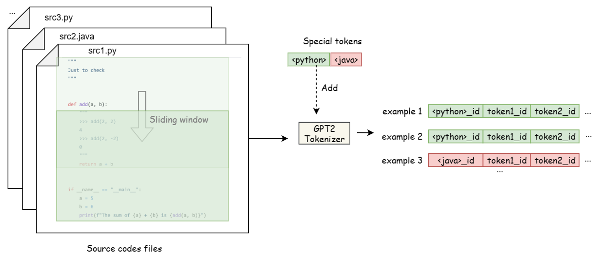

# Lab Report

#### Author: *刘佳隆*

#### Student ID: *518010910009*

## 总体介绍

### 参考来源

- 参考代码：https://github.com/wangcongcong123/auto_coding
- 原始数据来源：https://github.com/TheAlgorithms/Python
- 转化后的数据：https://github.com/wangcongcong123/auto_coding/tree/master/dataset
- 参考训练结果：https://huggingface.co/congcongwang/distilgpt2_fine_tuned_coder

### 代码结构

- `dataset/convert.py`：将原始数据集转换为 json 格式
- `analysis.py`：分析数据集的特征，并绘制相关图表
- `data.py`：根据选定的模型和语言，调用 `model.tokenizer` 将转化后的数据加载到模型中
- `evaluate.py`：评估模型的性能
- `interact.py`：加载训练好的模型并启动交互式代码生成
- `model.py`：定义模型的结构
- `my_train.ipynb`：在 Google Colab 或 Kaggle 上训练模型的 notebook
- `trainer.py`：定义模型的训练过程
- `train.py`：加载数据集并设置模型框架、训练参数、文件路径等，然后开始训练

### 使用方法

#### 使用数据集训练

受限于笔记本配置，本地训练较慢，因此迁移至 Google Colab 和 Kaggle进行训练。将数据集和初始模型上传至 Google
Drive 或 Kaggle Datasets，而后修改文件路径，运行 `my_train.ipynb` 即可。

#### 运行模型

将训练结果解压至 `./model` 目录下，然后修改 `interact.py` 中 `'--model_path'` 参数为 `"/model/[$model_name]"`
，然后运行 `interact.py` 即可。

## 系统设计

### 模型设计

#### 数据集转换

如下图所示，首先通过 `convert.py` 将数据集转换为 json 格式。在这个过程中数据集按照 9：1
的比例被分为训练集和测试集，分别存储在 `train.jsonl` 和 `dev.jsonl` 中。在训练时通过调用 `data.py` 中的 `SrcCodeDataset`
函数将 json 格式的数据集转换为模型所需的数据格式。

在此处我们选取 python 作为训练语言。



#### 参考模型设计

使用的模型 `GPTSingleHead` 定义于 `model.py`，其基于 gpt 模型将 `GPT2LMHeadModel` 和 `GPT2Tokenizer`
封装在一起。`GPT2LMHeadModel`
是 `transformers` 库中的模型，采用 Next Token Prediction（LM）的方式进行训练，用来进行自回归预训练，其可以传入 labels
张量来计算自回归交叉熵损失值 loss，继而利用自回归交叉熵损失值 loss 来优化整个GPT2模型。

其主要代码和函数解释如下：

``` python
class GPTSingleHead(nn.Module):
    """
    Different from directly using GPT2LMHeadModel, 
    this wraps up GPT2LMHeadModel as well as GPT2Tokenizer
    """

    def __init__(self, model_name_or_path: str, max_seq_length: int = 256, 
    do_lower_case: bool = False, special_words_to_add=None):
        """
        定义了一个名为 GPTSingleHead 的 PyTorch 模型类，用于创建 GPT2 模型
        :param model_name_or_path: 指定要加载或初始化的 GPT2 模型的名称或路径。
        :param max_seq_length: 指定输入序列的最大长度。
        :param do_lower_case: 指定是否将输入文本转换为小写。
        :param special_words_to_add: 用于指定要添加到 tokenizer 中的特殊词语。如 <python>, <java>
        """
        super(GPTSingleHead, self).__init__()
        self.config_keys = ['max_seq_length', 'do_lower_case']
        self.do_lower_case = do_lower_case
        if max_seq_length > 1024:
            logging.warning(
                "GPT only allows a max_seq_length of 1024. Value will be set to 1024")
            max_seq_length = 1024
        self.max_seq_length = max_seq_length
        self.gpt = GPT2LMHeadModel.from_pretrained(model_name_or_path)
        self.tokenizer = GPT2Tokenizer.from_pretrained(model_name_or_path, 
                                                       do_lower_case=do_lower_case)
        if special_words_to_add != None:
            self.add_special_words(special_words_to_add)

        self.bos_token_id = self.tokenizer.bos_token_id
        self.eos_token_id = self.tokenizer.eos_token_id
        # 设置模型属性

    def tokenize(self, text: str):  # default for cls
        """
        将输入文本转换为 token IDs 的序列。
        首先使用 tokenizer.tokenize 将文本标记化为 token 列表，
        然后使用 tokenizer.convert_tokens_to_ids 将 token 列表转换为对应的 token IDs。
        :param text: 输入文本
        :return: token IDs 的序列
        """
        return self.tokenizer.convert_tokens_to_ids(self.tokenizer.tokenize(text))

    def add_special_words(self, special_words_to_add):
        """
        添加特殊词语到 tokenizer 中，并调整模型的 token embeddings 大小以适应新的词汇量。
        :param special_words_to_add: 要添加到 tokenizer 中的特殊词语
        :return: None
        """
        orig_num_tokens = len(self.tokenizer)
        num_added_tokens = self.tokenizer.add_special_tokens(special_words_to_add)
        if num_added_tokens > 0:
            self.gpt.resize_token_embeddings(new_num_tokens=orig_num_tokens + num_added_tokens)

    def forward(self, input: Dict[str, torch.Tensor]):
        """
        定义模型的前向传播逻辑。
        接收一个名为 input 的字典作为输入，包含键为"input_ids"的输入token IDs。
        使用 self.gpt 模型将 input["input_ids"]作 为输入，并返回损失和 logit（模型的输出）。
        :param input: 一个字典，包含键为"input_ids"的输入token IDs。
        :return:  损失和 logit（模型的输出）
        """
        loss, logits = self.gpt(input["input_ids"], labels=input["input_ids"])[:2]
        return loss, logits

    def get_config_dict(self):
        """
        返回模型的配置字典，该字典包含在初始化函数中定义的配置参数。
        """
        return {key: self.__dict__[key] for key in self.config_keys}

    def padding_features(self, features_dict_list):
        """
        padding features for a batch
        对一个batch的特征进行padding。
        遍历features_dict_list中的每个特征字典，将每个特征的token IDs加入到对应的batch列表中。
        找到batch中最长的输入序列长度max_input_len_this_batch。
        根据max_input_len_this_batch对每个特征的token IDs进行padding，使其长度一致。
        :param features_dict_list: i.e., batch
        :return: padded batch features
        """
        max_input_len_this_batch = 0

        batch_features = {feature_name: [] for feature_name in features_dict_list[0]}
        for feature_dict in features_dict_list:
            for feature_name, feature_ids in feature_dict.items():
                if feature_name == "input_ids" and len(feature_ids) > max_input_len_this_batch:
                    max_input_len_this_batch = len(feature_ids)
                batch_features[feature_name].append(feature_ids)

        padded_batch_features = {feature_name: [] for feature_name in features_dict_list[0]}
        for feature_name, batch_ids in batch_features.items():

            for each_ids in batch_ids:
                padded = each_ids + [self.tokenizer.pad_token_id] * 
                         (max_input_len_this_batch - len(each_ids))
                padded_batch_features[feature_name].append(padded)

        for feature_name, ids in padded_batch_features.items():
            padded_batch_features[feature_name] = torch.tensor(ids)

        return padded_batch_features

    def get_embedding_dimension(self) -> int:
        """
        返回模型的嵌入维度。
        """
        return self.gpt.config.hidden_size

    def get_config(self) -> int:
        """
        返回模型的配置。
        """
        return self.gpt.config

    def save(self, output_path: str):
        """
        保存模型的权重、tokenizer和配置字典到指定路径。
        :param output_path: 模型保存路径
        :return: None
        """
        self.gpt.save_pretrained(output_path)
        self.tokenizer.save_pretrained(output_path)
        with open(os.path.join(output_path, 'gpt_sh_config.json'), 'w') as f:
            json.dump(self.get_config_dict(), f, indent=2)

    def reload(self, input_path: str):
        """reload from checkpoint weights"""
        return GPTSingleHead.load(input_path + "/0_GPTSingleHead")
```

### 训练方法

在 `train.py` 中，主要代码解释如下：

``` python
# initialize model by model name (the same as used in transformers lib)
model = GPTSingleHead(MODEL_MAP[args.model_select], max_seq_length=args.max_seq_length)
# load training dataset
file_path = dataset_folder + "train.jsonl"
train_dataset = SrcCodeDataset(file_path, model, 
                               cache_path=os.path.join(".cache", output_path, "train"))
# load developlemt dataset
file_path = dataset_folder + "dev.jsonl"
dev_dataset = SrcCodeDataset(file_path, model, 
                             cache_path=os.path.join(".cache", output_path, "dev"))
# initialize development evaluator
dev_evaluator = SingleCLMEvaluator()
# initialize model trainer
model_trainer = ModelTrainer(...)
# start training
model_trainer.train()
```

- `SrcCodeDataset` 定义于 `data.py`，用于批量加载经过转化后的源代码数据集，以便使用 GPT2LMModel 进行 fine-tuning。

- `SingleCLMEvaluator` 定义于 `evaluate.py`，用于评估模型的性能。

- `ModelTrainer` 定义于 `trainer.py`，用于设置模型参数、训练模型。

`trainer.py` 中的 `train()` 函数主要通过调用 `_train_epoch()` 函数来进行训练，`_train_epoch()`
函数主要通过迭代训练数据，计算损失值并进行梯度更新，同时根据设置的评估步数进行模型评估，并记录相关的训练信息和评估指标。此外，代码还包含了梯度累积、梯度裁剪、混合精度训练等功能，以优化训练过程。

主要代码解释如下：

``` python
    def _train_epoch(self, epoch: int, global_steps: int):
        epoch_steps = 0
        epoch_loss = 0.0

        self.model.zero_grad()
        # 首先，初始化epoch的步数（epoch_steps）和损失（epoch_loss）为0，
        # 并清空模型的梯度（self.model.zero_grad()）。

        for step, data in enumerate(
                tqdm(self._train_dataloader, desc="training", 
                     total=self._steps_per_epoch * self.accumulation_steps)):
            # 然后，对训练数据进行迭代，使用enumerate函数遍历数据加载器（self._train_dataloader）。
            # tqdm用于在终端显示进度条，desc参数设置进度条的描述为"training"，
            # total参数设置总的迭代次数为self._steps_per_epoch * self.accumulation_steps。

            self.model.train()
            if data["labels"] != "skip-device":
                input, labels = batch_to_device(data, self._device)
                # add labels to input for training where this step is ignored when inference
                if isinstance(labels, dict):
                    for idx in range(len(input)):
                        input[idx].update(labels)
            else:
                input = data["features"]
            # 在每个步骤中，将模型设置为训练模式（self.model.train()）。
            # 然后，检查数据中是否存在标签（data["labels"] != "skip-device"）。
            # 如果存在标签，则将输入数据（input）和标签数据（labels）移到指定设备（self._device）。
            # 如果标签是一个字典，则将标签添加到输入数据中。
            # 如果数据中没有标签，则将输入数据设置为data["features"]。

            loss_value, _ = self.model(input)

            if self._n_gpu > 1:
                loss_value = loss_value.mean()
            if self.accumulation_steps > 1:
                loss_value = loss_value / self.accumulation_steps
            # 计算模型对输入数据的输出（loss_value）。
            # 如果使用多个GPU进行训练（self._n_gpu > 1），则对损失值进行平均。
            # 如果使用梯度累积（self.accumulation_steps > 1），则将损失值除以累积步数。

            if self._fp16:
                try:
                    from apex import amp
                except ImportError:
                    raise ImportError(
                        "Please install apex to use fp16 training.")
                with amp.scale_loss(loss_value, self._optimizer) as scaled_loss:
                    scaled_loss.backward()
                torch.nn.utils.clip_grad_norm_(amp.master_params(self._optimizer), 
                                               self._max_grad_norm)
            else:
                loss_value.backward()
                torch.nn.utils.clip_grad_norm_(self.model.parameters(), self._max_grad_norm)
            epoch_loss += loss_value
            # 根据是否启用混合精度训练（self.fp16），计算并反向传播损失值（loss_value）。
            # 如果启用混合精度训练，使用Apex库对损失值进行缩放（amp.scale_loss）和反向传播。
            # 然后，使用梯度裁剪（torch.nn.utils.clip_grad_norm）限制梯度的大小，以避免梯度爆炸。
            # 最后，将损失值添加到epoch_loss中。

            if (step + 1) % self.accumulation_steps == 0:
                self._optimizer.step()
                self._scheduler.step()
                self.model.zero_grad()

                epoch_steps += 1
                total_global = epoch_steps + global_steps
                # 如果达到了累积步数（self.accumulation_steps），则进行梯度更新。
                # 调用优化器的step方法（self._optimizer.step()）执行梯度更新，
                # 调用学习率调度器的step方法（self._scheduler.step()）更新学习率。
                # 然后清空模型的梯度（self.model.zero_grad()）。
                # 增加epoch步数（epoch_steps），计算总的全局步数（total_global）。

                if self._evaluation_steps > 0 and (total_global) % self._evaluation_steps == 0:
                    # 如果设置了评估步数（self._evaluation_steps > 0），
                    # 并且当前步数是评估步数的倍数，则进行模型评估。

                    dev_loss, eval_scores = self._dev_eval_in_training(epoch, epoch_steps)
                    logger.info("...")
                    if dev_loss != None:
                        logger.info(f"  dev_loss = {dev_loss:.6f}\t||\t")
                        logger.info(f"  dev_eval_scores = {eval_scores}")
                    else:
                        logger.info(f"  dev_eval_scores = {eval_scores}")
                    # 进行模型评估，并获取开发集的损失（dev_loss）和评估指标（eval_scores）。
                    # 然后打印评估报告的各种信息，如输出路径、早停策略、评估步数、最佳评估指标分数等。

                    train_loss = epoch_loss / epoch_steps
                    logger.info(f"  train_loss = {train_loss}")
                    logger.info("\n********************************************")

                    if is_wandb_available() and self.wandb_config != None:
                        if dev_loss != None:
                            wandb.log(...)
                        else:
                            wandb.log(...)
                    # 计算平均训练损失（train_loss），并将其记录到日志中。
                    # 如果使用了wandb（Weights & Biases）库，并且配置了wandb_config，
                    # 则将训练损失、开发集损失、最佳评估指标分数和学习率记录到wandb中。

                    for key, value in eval_scores.items():
                        if is_wandb_available() and self.wandb_config != None:
                            wandb.log({f"eval_{key}_dev": value}, step=total_global)
                        self._tb_writer.add_scalar(f"eval_{key}_dev", value, total_global)

                    self._tb_writer.add_scalar("lr", self._scheduler.get_lr()[0], total_global)
                    if dev_loss != None:
                        self._tb_writer.add_scalar("loss_dev", dev_loss, total_global)

                    self._tb_writer.add_scalar("loss_train", train_loss, total_global)

                    if self._early_stop_count >= self.early_stop:
                        logger.info(...)
                        sys.exit(0)
            # 将评估指标的值记录到TensorBoard中，使用TensorBoard写入器（self._tb_writer）。
            # 同时，将学习率、开发集损失和训练损失记录到TensorBoard中。
            # 达到早停策略中设置的停止次数（self._early_stop_count >= self.early_stop），
            # 即开发集的损失在连续的评估步骤中没有减少，就会触发早停策略。
            # 在这种情况下，程序记录日志信息，指示连续的评估步骤没有减少损失，
            # 并使用sys.exit(0)退出程序。

        return epoch_loss, epoch_steps
```

## 实验结果

### 调参实验及结果 & 训练过程

#### 主要参数说明

文件路径、评估步数、早停策略、训练配置等在训练过程中不变的参数设置和说明如下：

| 参数名                      | 参数值           | 说明                                   |
|--------------------------|---------------|--------------------------------------|
| model_select             | distilgpt2    | 模型的类型。                               |
| dataset_name             | source_code   | 数据集的名称，即放置在"./dataset"目录中的数据集文件夹的名称。 |
| per_gpu_train_batch_size | 4             | 每个GPU用于训练的输入批次大小。                    |
| dev_batch_size           | 8             | 用于开发（验证）的输入批次大小。                     |
| early_stop               | 20            | 提前停止训练的步数。                           |
| scheduler                | warmuplinear  | 学习率调度器的类型。                           |
| seed                     | 122           | 随机种子，用于实验的可重复性。                      |
| accumulation_steps       | 1             | 如果希望使用较大的批次大小但内存不足以容纳，可以使用累积梯度的步数。   |
| n_gpu                    | 1             | 用于训练的GPU数量。                          |
| visiable_device          | 0             | 用于训练的可见GPU设备的索引，应与n_gpu一致。           |
| evaluation_steps         | 200           | 评估模型性能的步数。                           |
| wandb_project_name       | code_generate | 用于wandb（一个模型跟踪和实验管理工具）的项目名称。         |
| restore_training         | False         | 如果存在保存的检查点，则恢复训练。                    |
| with_wandb               | True          | 使用wandb进行训练跟踪。                       |

与训练过程相关的参数说明如下：

| 参数名              | 说明                |
|------------------|-------------------|
| num_epochs_train | 训练的轮数。            |
| max_seq_length   | 输入序列的最大长度。        |
| lr               | 学习率。              |
| warmup_ratio     | 学习率调度器中的warmup比例。 |

模型大小：Total params: 81914880

#### 第一次训练

参数设置如下：

| 参数名              | 参数值  |
|------------------|------|
| num_epochs_train | 1    |
| max_seq_length   | 256  |
| lr               | 1e-5 |
| warmup_ratio     | 0.2  |

训练过程如下：


评估结果如下：


训练结果如下：

| 参数名                   | 参数值                 |
|-----------------------|---------------------|
| best_score_perplexity | -3.1740331649780273 |
| dev_eval_scores       | 3.1755013465881348  |
| dev_loss              | 1.155465            |
| train_loss            | 1.5959064960479736  |

#### 第二次训练

参数设置如下：

| 参数名              | 参数值  |
|------------------|------|
| num_epochs_train | 1    |
| max_seq_length   | 128  |
| lr               | 1e-5 |
| warmup_ratio     | 0.2  |

训练过程如下：


评估结果如下：


训练结果如下：

| 参数名                   | 参数值                |
|-----------------------|--------------------|
| best_score_perplexity | -4.196605682373047 |
| dev_eval_scores       | 4.199092388153076  |
| dev_loss              | 1.434868           |
| train_loss            | 1.9175739288330078 |

#### 第三次训练

参数设置如下：

| 参数名              | 参数值  |
|------------------|------|
| num_epochs_train | 1    |
| max_seq_length   | 256  |
| lr               | 1e-4 |
| warmup_ratio     | 0.2  |

训练过程如下：


评估结果如下：


训练结果如下：

| 参数名                   | 参数值                 |
|-----------------------|---------------------|
| best_score_perplexity | -1.5279237031936646 |
| dev_eval_scores       | 1.5282740592956543  |
| dev_loss              | 0.424139            |
| train_loss            | 0.924028217792511   |

#### 第四次训练

参数设置如下：

| 参数名              | 参数值  |
|------------------|------|
| num_epochs_train | 1    |
| max_seq_length   | 256  |
| lr               | 1e-5 |
| warmup_ratio     | 0.1  |

训练过程如下：


评估结果如下：


训练结果如下：

| 参数名                   | 参数值                 |
|-----------------------|---------------------|
| best_score_perplexity | -3.1631147861480713 |
| dev_eval_scores       | 3.1644909381866455  |
| dev_loss              | 1.151992            |
| train_loss            | 1.4988362789154053  |

#### 对比

| 参数名                   | 第一次训练               | 第二次训练              | 第三次训练               |
|-----------------------|---------------------|--------------------|---------------------|
| num_epochs_train      | 1                   | 1                  | 1                   |
| max_seq_length        | 256                 | 128                | 256                 |
| lr                    | 1e-5                | 1e-5               | 1e-4                |
| warmup_ratio          | 0.2                 | 0.2                | 0.2                 |
| best_score_perplexity | -3.1740331649780273 | -4.196605682373047 | -1.5279237031936646 |
| dev_eval_scores       | 3.1755013465881348  | 4.199092388153076  | 1.5282740592956543  |
| dev_loss              | 1.155465            | 1.434868           | 0.424139            |
| train_loss            | 1.5959064960479736  | 1.9175739288330078 | 0.924028217792511   |

| 参数名                   | 第四次训练               | 参考模型                |
|-----------------------|---------------------|---------------------|
| num_epochs_train      | 1                   | 16                  |
| max_seq_length        | 256                 | 256                 |
| lr                    | 1e-5                | 2e-5                |
| warmup_ratio          | 0.1                 | 0.2                 |
| best_score_perplexity | -3.1631147861480713 | -1.2681105136871338 |
| dev_eval_scores       | 3.1644909381866455  | 1.268279790878296   |
| dev_loss              | 1.151992            | 0.237662            |
| train_loss            | 1.4988362789154053  | 0.3555217981338501  |

训练过程对比：


评估结果对比：


受限于计算资源，相比于参考模型，本次实验的训练轮数较少，因此训练结果较差。但是，通过对比可以发现，第三次训练的结果相比于其他训练结果有较大的提升，训练结果也十分接近参考模型。

通过已有的训练数据对比可以得出如下结论：

- 输入序列的最大长度 max_seq_length 和 学习率 lr 对训练过程中的效率和最终训练结果有较大的影响。max_seq_length 和 lr
  越大，每一步的训练效率越高，且训练结果越好。
- 学习率调度器中的 warmup 比例 warmup_ratio 对初始训练过程有一定影响，但通过多轮训练后，其影响逐渐减小，最终可以忽略。

### 生成代码展示

使用第三次训练的模型生成代码，并与参考训练结果进行对比。

训练模型生成的代码如下：


参考模型生成的代码如下：


通过对比可以发现，训练模型生成的代码与参考模型生成的代码在语法上基本一致，通过调整参数可以在较少的轮次达到与参考模型十分接近的训练结果。但是两种distilgpt2
模型生成的代码的语义性较差，且代码的结构不够完整，基本不能完成代码生成任务。与参考代码中使用 GPT2-medium 模型生成的代码在质量上相差极大。
